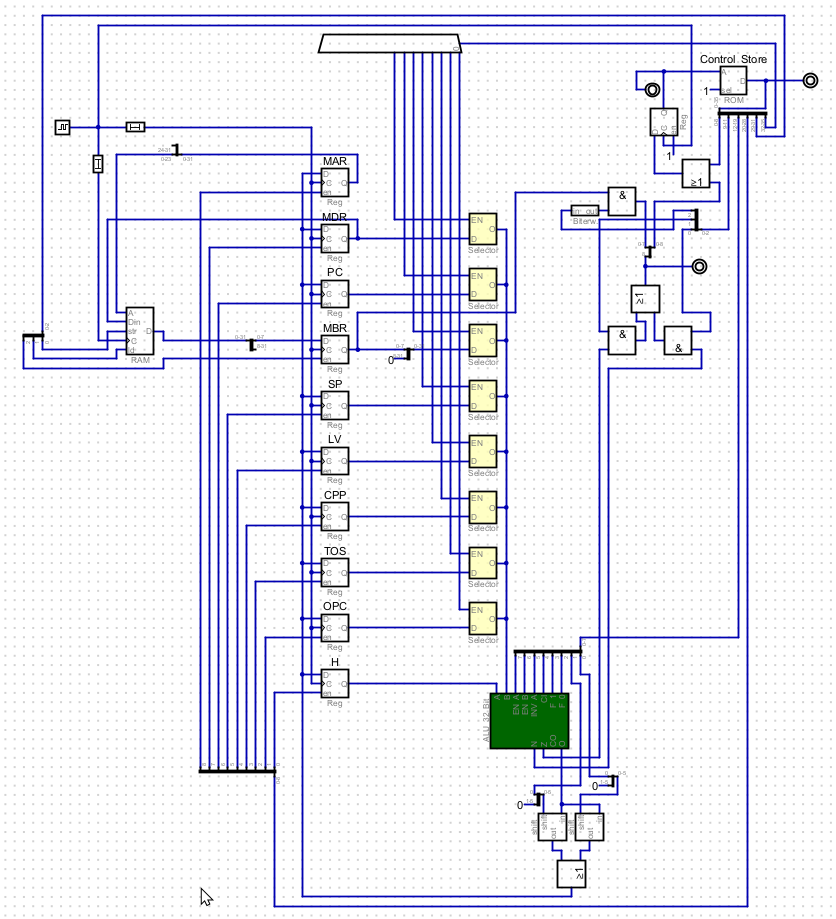

# Mic1

This repository contains the source code and documentation for the MIC 1 Simulator in the Digital programm.

## Table of Contents

- [Mic1](#mic1)
  - [Table of Contents](#table-of-contents)
  - [Introduction](#introduction)
  - [Features](#features)
  - [Installation](#installation)
  - [Usage](#usage)
  - [Contributing](#contributing)
  - [License](#license)

## Introduction

The MIC 1 Simulator is a digital programm that simulates the operation of the MIC 1 (Microprogrammed Interpretive Computer) architecture. It provides a virtual environment for executing MIC 1 assembly programs and observing the state of the computer during execution.

## Features

- Interactive assembly program execution
- Real-time display of computer state (registers, memory, program counter, etc.)
- Step-by-step execution with breakpoints
- Memory and register inspection
- Program loading and saving

## Installation

To install the MIC 1 Simulator, follow these steps:

1. Clone this repository to your local machine.
2. Open the project in your preferred development environment.
3. Build the project to generate the executable file.
4. Run the executable file to start the MIC 1 Simulator.

## Usage

To use the MIC 1 Simulator, follow these steps:

1. Launch the MIC 1 Simulator.
2. Load an assembly program file or write your own program.
3. Start the execution of the program.
4. Use the provided controls to step through the program or pause/resume execution.
5. Observe the state of the computer in real-time.
6. Analyze the program output and debug any issues.

## Contributing

Contributions to the MIC 1 Simulator are welcome! If you would like to contribute, please follow the guidelines outlined in the [CONTRIBUTING.md](CONTRIBUTING.md) file.

## License

The MIC 1 Simulator is licensed under the [MIT License](LICENSE).
